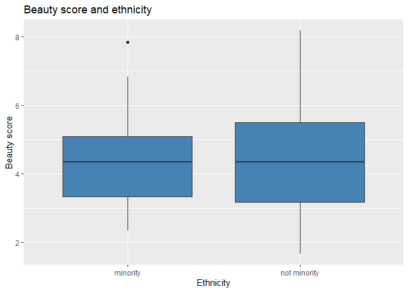

Lab5Doc
================
James Boyle
07/06/2021

## Introduction

This is a test using GitHub. I will also use it to make a report using
some data. I will use the evals data to create some stuff.

## Exploratory data analysis

First of all, here is a pointless link to the introduction, just to show
I can do it 

Not worked for some reason. Anyway. This report will look for a
relationship between beauty score and ethnicity using the evals data.  
It is not written in a professional manner. It’s just practice.

First of all, some summary statistics.

<table class="table" style="font-size: 10px; margin-left: auto; margin-right: auto;">

<caption style="font-size: initial !important;">

Summary statistics on beauty score by ethnicity.

</caption>

<thead>

<tr>

<th style="text-align:left;">

Ethnicity

</th>

<th style="text-align:right;">

Number

</th>

<th style="text-align:right;">

Beauty score

</th>

<th style="text-align:right;">

SD

</th>

<th style="text-align:right;">

1st Q

</th>

<th style="text-align:right;">

3rd Q

</th>

<th style="text-align:right;">

Min.

</th>

<th style="text-align:right;">

Max

</th>

<th style="text-align:right;">

Median

</th>

</tr>

</thead>

<tbody>

<tr>

<td style="text-align:left;">

minority

</td>

<td style="text-align:right;">

64

</td>

<td style="text-align:right;">

4.58

</td>

<td style="text-align:right;">

1.47

</td>

<td style="text-align:right;">

3.333

</td>

<td style="text-align:right;">

5.08325

</td>

<td style="text-align:right;">

2.333

</td>

<td style="text-align:right;">

7.833

</td>

<td style="text-align:right;">

4.333

</td>

</tr>

<tr>

<td style="text-align:left;">

not minority

</td>

<td style="text-align:right;">

399

</td>

<td style="text-align:right;">

4.39

</td>

<td style="text-align:right;">

1.54

</td>

<td style="text-align:right;">

3.167

</td>

<td style="text-align:right;">

5.50000

</td>

<td style="text-align:right;">

1.667

</td>

<td style="text-align:right;">

8.167

</td>

<td style="text-align:right;">

4.333

</td>

</tr>

</tbody>

</table>

This does not really show much interesting.

Now look at some boxplots

Beauty for ethnicity.

